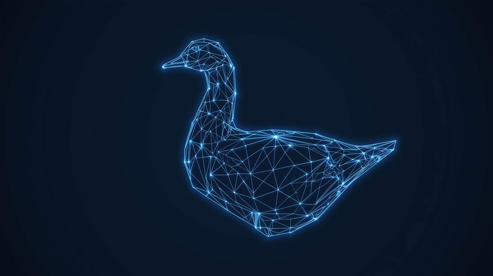
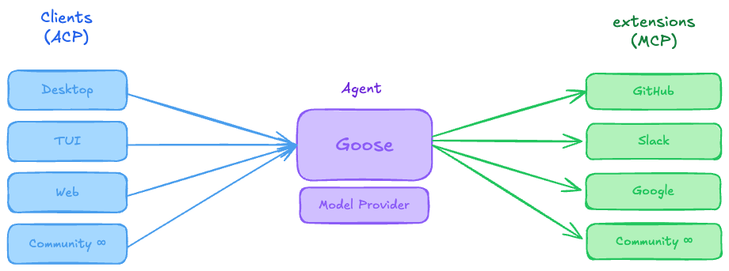

## goose history

goose has always embraced open protocols and standards. From the very early days our project co-evolved with the [Model Context Protocol](https://modelcontextprotocol.io).
goose's extension feature was informed by MCP's design, and goose helped to influence MCP as well. However the biggest impact MCP has had on goose was that it enabled us to
tap into a vibrant and fast-growing ecosystem of MCP servers written by developers and agents around the world from our open source project.

For the 2.0 release of goose we want to lean into this pattern and migrate several of our existing features with bespoke implementations to open standards in their respective areas.
First up is ACP...

## ACP

We have had support in goose for the Agent Client Protocol since September 2025 ([PR](https://github.com/aaif-goose/goose/pull/4511)) and since that time we have made our integration
with this protcol more full-featured. It is now possible to control the goose agent from any ACP compatible client, and also to use goose as an ACP client for other ACP agents. Our more
complete adoption of ACP as the default protocol for controlling goose means we will be able to deprecate and remove our custom `goosed` API which we have used in our desktop and mobile
apps to date to send instructions and modify configuration of goose.

We are taking things a step further by supporting ACP exchanges to goose over a new HTTP/WS transport for the protocol and we have submitted an [RFD[(https://github.com/agentclientprotocol/agent-client-protocol/pull/721)
to the protocol. With this new transport it will be possible to host ACP capable agents in cloud environments and have them work remotely - perfect for longer running agent workloads. Coupling this with extensions powered
by Streamable HTTP MCP connections this creates a potent architectural combination enabling the agent workload to move flexibly between local deployments, cloud providers, containerized environments, etc.

By making ACP the front door to goose, we are opening the agent to an entire ecosystem of clients we will never have to build ourselves — every developer who wants a custom UX, a specialized
workflow, or a tighter integration with their own tools can now build exactly that.

## SDK

As part of the work on the new TUI, we created a node module we expect to also have value as a standalone SDK for goose. Installing the [@aaif/goose-acp](https://www.npmjs.com/package/@aaif/goose-acp) (TODO - Rename it to SDK)
package will let you write a program in TypeScript that uses goose for agentic functionality. This is one step more free in terms of how you can customize the experience, using an embedded goose for any agentic functionality
you want to add to your program.

See documentation for this package [here](https://github.com/aaif-goose/goose/blob/main/ui/acp/README.md)

## new clients

We have first party support for two new clients: terminal and desktop. The new TUI is rendered by [ink](https://github.com/vadimdemedes/ink) and is available on npm by running: `npx @aaif/goose`.
The new desktop app is [tauri](https://v2.tauri.app/) based and will have the core goose GUI features from v1.0 supported in addition to expanded visual support for concepts like skills and plugins.
Both new clients are powered by the goose ACP agent server and can connect over stdio or the draft HTTP/WS transport.

TODO - TUI Screenshot

TODO - Desktop Screenshot

## Plugins?

## conclusion

opening up the stack in this way means many more usage patterns are possible, and we look forward to working with everyone in the community on your ideas. please join us in [discord](https://discord.gg/sH3YAhHG)
to communicate and collaborate on new ideas.

goose 2.0 represents a meaningful milestone in how we build open source AI agents; not by accumulating proprietary features, but by embracing open protocols and standards that make agents more
capable, interoperable, and portable. By grounding our architecture in MCP and ACP, we are betting on ecosystems over lock-in — giving developers the freedom to connect any compatible client, host
workloads anywhere, and extend goose with components built by a global community. The new terminal and desktop clients are proof that this foundation is working, delivering first-class experiences
powered entirely by open standards. As these protocols mature and the communities around them grow, so too will goose — and that's exactly how it should be.

<head>
  <meta property="og:title" content="goose 2.0 architecture" />
  <meta property="og:type" content="article" />
  <meta property="og:url" content="https://goose-docs.ai/blog/2026/04/08/goose-2-0-arch" />
  <meta property="og:description" content="an overview of goose's new architecture" />
  <meta property="og:image" content="https://goose-docs.ai/assets/images/TODO.png" />
  <meta name="twitter:card" content="summary_large_image" />
  <meta property="twitter:domain" content="goose-docs.ai" />
  <meta name="twitter:title" content="goose 2.0 architecture" />
  <meta name="twitter:description" content="an overview of goose's new architecture" />
  <meta name="twitter:image" content="https://goose-docs.ai/assets/images/TODO.png" />
</head>
